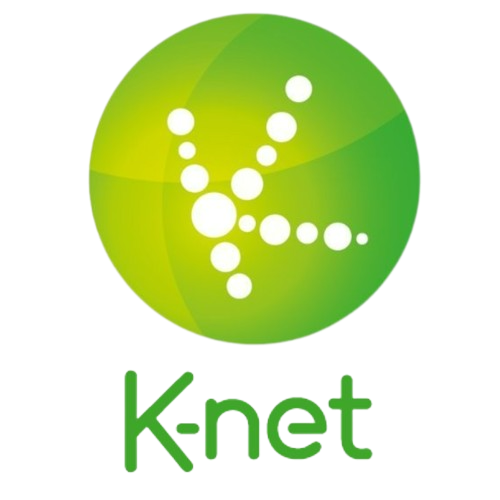

  <h3>🇫🇷</h3>
  
 
  
  
  
  

___

<h1>Playlist IPTV</h1>

<h2>TV</h2>

  
  
  
  
Chaînes qu'on retrouve la plupart du temps sur Internet mais plus souvent par satelite.

<h2>Streaming</h2>

  

  
  
  
  
  
  
  
  
  
  
  
  
  
  
  
  
  

Chaînes qu'on retrouve sur des sites de streaming ou autre.

<h2>Radio</h2>

  

Station Radio qu'on peut trouver en ligne, FM ou MHz.

<h2>Status</h2>

  |  Stream  | Badge |
  |----------|-------|
  |    TF1   |  |
  | France 2 |  |
  | France 3 |  |
  |  Canal+  |  |
  | France 5 |  |
  |    C8    |  |
  | France 4 |  |
  |   CNews  |  |
  |   CStar  |  |
  | franceinfo: |  |
  |   LCI    |  |

___

<h1>Statistiques</h1>

 
</a>

