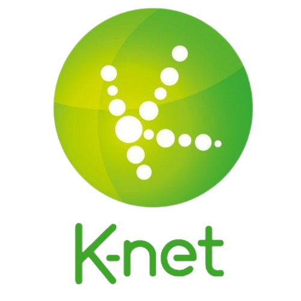

  <h3>🇫🇷</h3>
  
  
  
  
  
  

<h1>Playlist IPTV</h1>

<h2>TV</h2>

  

    
    
Chaînes qu'on retrouve la plupart du temps sur Internet mais plus souvent par satelite
  

<h2>Streaming</h2>

  
  
  
  
  
  
  
  
  

  

  

  

  

  

  

  

  

  

 Chaînes qu'on retrouve sur des sites de streaming ou autre 

<h2>Radio</h2>

  

 Station Radio qu'on peut trouver en ligne, FM ou MHz 

<h2>Alternative</h2>

| Playlist | Alternative | Source |
|----------|-------------|--------|
| <a href="IPTV/TNT.m3u?raw=true">TNT</a> | <a href="https://www.6play.fr/">6play</a>, <a href="https://www.france.tv/">France TV</a>, <a href="https://www.tf1.fr/">MYTF1</a>, <a href="https://www.molotov.tv/">Molotov</a> | Site Officiel |
| <a href="https://i.mjh.nz/PlutoTV/fr.m3u8">Pluto TV</a> | <a href="https://pluto.tv/">Pluto TV</a> | Site Officiel |
| <a href="https://i.mjh.nz/SamsungTVPlus/fr.m3u8">Samsung TV Plus</a> | <a href="https://www.samsung.com/fr/smart-tv/samsung-tv-plus/">Samsung TV Plus</a> | Site Officiel |
| <a href="https://github.com/iptv-org/iptv/blob/master/streams/fr_euronews.m3u?raw=tru">euronews</a> | <a href="https://www.youtube.com/@euronews/channels">euronews</a> | YouTube |
| <a href="https://github.com/iptv-org/iptv/blob/master/streams/fr_rakuten.m3u?raw=true">Rakuten</a> | <a href="https://www.rakuten.tv/">Rakuten TV</a> | Site Officiel |
| <a href="https://github.com/iptv-org/iptv/blob/master/streams/fr_fashiontv.m3u?raw=true">FashionTV</a> | <a href="https://fashiontv.com/">FashionTV+</a> | Site Officiel |
| <a href="https://github.com/iptv-org/iptv/blob/master/streams/fr_france24.m3u?raw=true">France 24</a> | <a href="https://www.youtube.com/@FRANCE24/channels">France 24</a> | YouTube |
| <a href="https://github.com/iptv-org/iptv/blob/master/streams/fr_groupecanalplus.m3u?raw=true">Canal+</a> | <a href="https://www.canalplus.com/live/">Canal+</a> | Site Officiel |
| <a href="https://github.com/iptv-org/iptv/blob/master/streams/fr_groupem6.m3u?raw=true">M6</a> | <a href="https://www.6play.fr/">6play</a> | Site Officiel |
| <a href="https://github.com/iptv-org/iptv/blob/master/streams/fr_persiana.m3u?raw=true">Persiana</a> | <a href="https://persianagroup.tv/">Persiana Media Group</a> | Site Officiel |
| <a href="IPTV/Stream4free.m3u?raw=true">Stream4free</a> | <a href="https://www.stream4free.live/">Stream4free</a> | Site Officiel |

Si les playlists que vous utilisé ne marche pas voici des alternative pour les remplacer

<h2>Question</h2>

<h3>C'est quoi <a href="IPTV/ALL.m3u">ALL</a> ?</h3>

<a href="IPTV/ALL.m3u">ALL</a> est une playlist de toute les chaînes gratuite et payante.</a>

