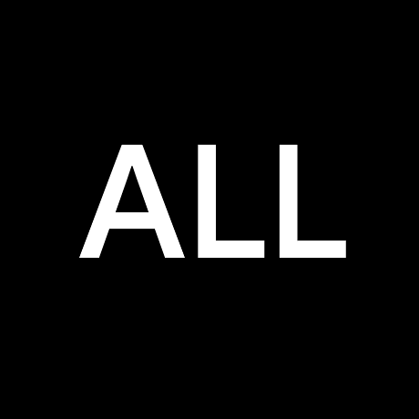

  <h3>🇫🇷</h3>
  
  
  
  
  
  

<h1>Playlist IPTV</h1>

<h2>⚠️ Problème ⚠️</h2>

  
Les chaînes de la playlist <a href="https://go2.do/rY">TNT</a> ne marchent plus! Cela vient du fournisseur et non de moi. (Voir <a href="https://github.com/LeBazarDeBryan/XTVZ_/issues/3">#3</a>.) Je vous recommande d'utiliser la playlist <a href="https://go2.do/s1">Officiel.m3u</a> (XTVZ_) jusqu'à que ce problème soit réparé. Merci de votre compréhension.

<h2>TV</h2>

  

    
    
Chaînes qu'on retrouve la plupart du temps sur Internet mais plus souvent par satelite.

  

<h2>Streaming</h2>

  

  
  
  
  
  
  
  
  
  

  

  

  

  

  

  

  

  

  

  

Chaînes qu'on retrouve sur des sites de streaming ou autre.

<h2>Radio</h2>

  

Station Radio qu'on peut trouver en ligne, FM ou MHz.

<h2>Alternative</h2>

| Playlist | Alternative | Source |
|----------|-------------|--------|
| <a href="https://go2.do/rY">TNT</a> | <a href="https://www.clictune.com/jsgE">6play</a>, <a href="https://www.clictune.com/jsgF">France TV</a>, <a href="https://www.clictune.com/jsgH">MYTF1</a>, <a href="https://www.clictune.com/jsgI">Molotov</a> | Site Officiel |
| <a href="https://www.clictune.com/jsgJ">Pluto TV</a> | <a href="https://www.clictune.com/jsgT">Pluto TV</a> | Site Officiel |
| <a href="https://www.clictune.com/jsgK">Samsung TV Plus</a> | <a href="https://www.clictune.com/jsgU">Samsung TV Plus</a> | Site Officiel |
| <a href="https://www.clictune.com/jsgL">euronews</a> | <a href="https://www.clictune.com/jsgV">euronews</a> | YouTube |
| <a href="https://www.clictune.com/jsgM">Rakuten</a> | <a href="https://www.clictune.com/jsgW">Rakuten TV</a> | Site Officiel |
| <a href="https://www.clictune.com/jsgN">FashionTV</a> | <a href="https://www.clictune.com/jsgX">FashionTV+</a> | Site Officiel |
| <a href="https://www.clictune.com/jsgQ">France 24</a> | <a href="https://www.clictune.com/jsgY">France 24</a> | YouTube |
| <a href="https://www.clictune.com/jsgR">Canal+</a> | <a href="https://www.clictune.com/jsgZ">Canal+</a> | Site Officiel |
| <a href="https://www.clictune.com/jsgR">M6</a> | <a href="https://www.clictune.com/jsgE">6play</a> | Site Officiel |
| <a href="https://www.clictune.com/jsgS">Persiana</a> | <a href="https://www.clictune.com/jsh3">Persiana Media Group</a> | Site Officiel |
| <a href="https://www.clictune.com/jsg2">Stream4free</a> | <a href="https://www.clictune.com/jsh4">Stream4free</a> | Site Officiel |
| <a href="https://www.clictune.com/jx7R">BFM TV</a> | <a href="https://www.bfmtv.com/regions/">BFM TV</a> | Site Officiel |

Si les playlists que vous utilisez ne marchent pas voici des alternatives pour les remplacer.

<h2>Question</h2>

  <h3>C'est quoi <a href="https://www.clictune.com/jsg1">ALL</a> ?</h3>
  
<a href="https://www.clictune.com/jsg1">ALL</a> est une playlist de toute les chaînes gratuite et payante.

